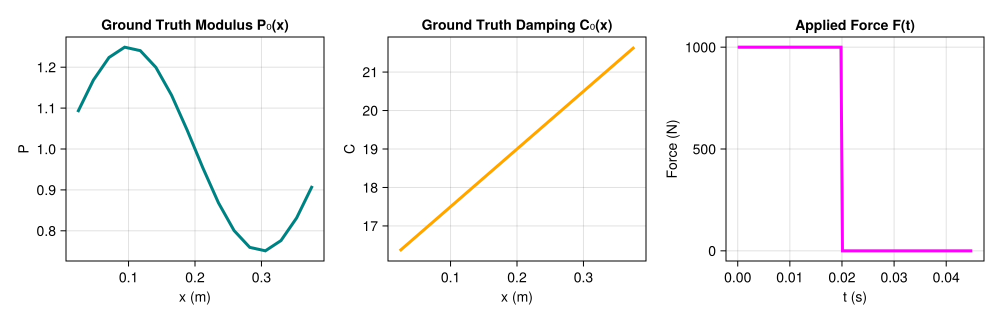
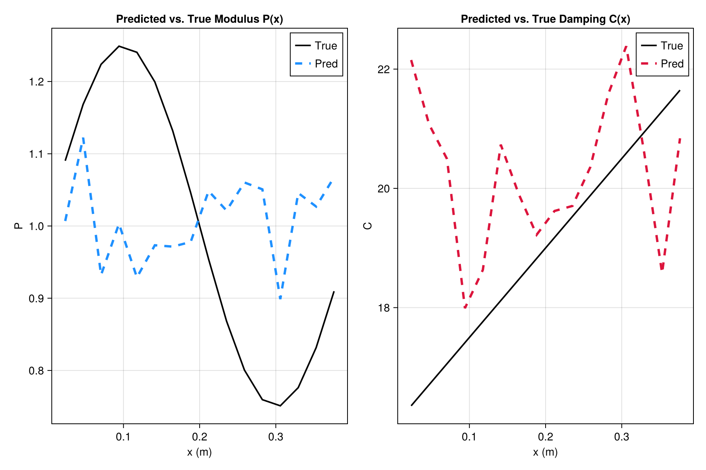
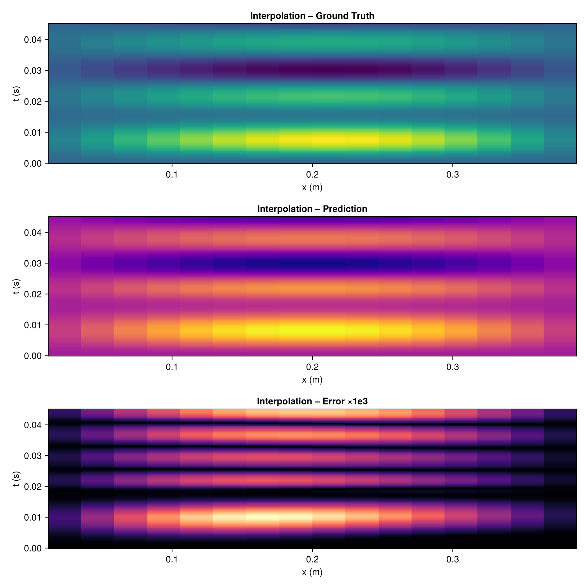
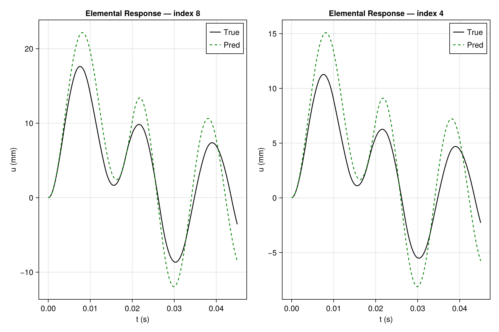

# 🧠 NeuralSI-modern-julia12

## ⚠️ Disclaimer

All figures and numerical results shown in this repository are **demonstrative only**.  
They were generated from a _reduced training run (1–2 epochs)_ intended to verify the functionality  
of the codebase and plotting pipeline.

The results **do not represent physically meaningful or converged NeuralSI solutions**.  
To reproduce the quantitative results from the original ECCV 2022 paper,  
the model must be trained for the full schedule (≈200 epochs with tuned hyperparameters).

---

### Structural Parameter Identification with Physics-Informed Neural Networks

> **Modernized Julia implementation of [NeuralSI: Structural Parameter Identification in Nonlinear Dynamical Systems (Li et al., ECCV 2022)](https://arxiv.org/abs/2208.12771)**  
> Reproduced and updated for using with latest version of Julia 1.12.

---

## 📖 Overview

This repository is a **fully modernized Julia (≥ 1.12)** reproduction of the original **NeuralSI** framework by  
**Xuyang Li et al., _ECCV 2022_**.

The system integrates **differentiable physics** (`DifferentialEquations.jl`, `ModelingToolkit.jl`)  
with **deep neural parameterization** (`Flux.jl`, `Optimisers.jl`) to **learn spatially varying stiffness and damping fields**  
from observed nonlinear structural responses.

<p align="center">
  
  <br>
  <em>Fig. — Beam setup showing spatial modulus P₀(x), damping C₀(x), and applied force F(t).</em>
</p>

---

## 🚀 Key Features

| Category                              | Description                                                                                                          |
| ------------------------------------- | -------------------------------------------------------------------------------------------------------------------- |
| 🧩 **Language Update**                | Ported from legacy Julia 1.6 → 1.12 with full compatibility under `Flux.jl v0.15`, `Zygote.jl`, and `Optimisers.jl`. |
| ⚙️ **Refactored Pipeline**            | Modular structure separating physics, networks, loss, and visualization.                                             |
| 🧮 **Performance Enhancements**       | Added `@views`, `@inbounds`, memory-safe array reuse, CPU multithreading, and future GPU support via `CUDA.jl`.      |
| 🎨 **High-Quality Visualization**     | New `CairoMakie` plotting suite replicating all ECCV 2022 figures with clean modern aesthetics.                      |
| 🧠 **Physics + Learning Integration** | Couples neural parameter fields with structural ODEs via `ModelingToolkit` symbolic pipelines.                       |
| 💾 **Auto-Saving Workflow**           | Automatically exports results and publication-ready PNG/PDFs to `results/figs`.                                      |

---

## 🧰 Environment Setup

```bash
# Clone repository
git clone https://github.com/SakifKhan98/NeuralSI-modern-julia12.git
cd NeuralSI-modern-julia12

# Activate project
julia --project=.
```

Inside the Julia REPL:

```julia
import Pkg
Pkg.instantiate()   # installs dependencies
```

---

## ▶️ Running the End-to-End Pipeline

```bash
julia --project=. src/main.jl
```

This will:

1. Construct the beam model and generate ground-truth trajectories.
2. Train the NeuralSI network for the defined number of epochs.
3. Evaluate interpolation and extrapolation accuracy.
4. Save results under:
   - `data/` → numerical arrays (`y.txt`, `pred.txt`, etc.)
   - `results/figs/` → publication-quality PNG + PDF figures.

Example terminal output:

```
training done!
Interpolation MAE: 0.00168
Extrapolation  MAE: 0.00469
Saved outputs → results/figs
```

---

## 🖼️ Example Figures

### 🔧 Parameter Identification

<p align="center">
  
  <br>
  <em>Predicted vs True stiffness P(x) and damping C(x).</em>
</p>

### 🌡️ System Response Reconstruction

<p align="center">
  
  <br>
  <em>Interpolation response heatmaps (ground truth | prediction | error).</em>
</p>

### ⏱️ Temporal Traces

<p align="center">
  
  <br>
  <em>Elemental displacement responses at mid- and quarter-span locations.</em>
</p>

---

## 🧩 Reproducing Figures Only

If you have already trained the model and stored data in `data/`, you can regenerate all figures with:

```julia
include("src/plotting.jl")
using .Plotting

Plotting.generate_all_figures(
    xll = LinRange(0, 0.4, 18)[2:end-1],
    tl  = LinRange(0, 0.045, 160),
    tl2 = LinRange(0, 0.09, 320),
    y   = readdlm("data/y.txt"),
    y2  = readdlm("data/y-extrapolate.txt"),
    pred1 = readdlm("data/NeuralSI-pred.txt"),
    pred2 = readdlm("data/NeuralSI-pred2.txt"),
    vp0 = readdlm("data/vp0.txt"),
    vc0 = readdlm("data/vc0.txt"),
    p   = readdlm("data/p_final.txt"),
    p0  = readdlm("data/p0.txt"),
    Nx  = 16,
    myforce_fn = myforce
)
```

All figures (PNG + PDF) will be saved in `results/figs/`.

---

## 📊 Citation

If you use this code or build on these results, please cite the original paper:

```bibtex
@inproceedings{li2022neuralsi,
  title={NeuralSI: Structural Parameter Identification in Nonlinear Dynamical Systems},
  author={Li, Xuyang and Bolandi, Hamed and Salem, Talal and Lajnef, Nizar and Boddeti, Vishnu Naresh},
  booktitle={European Conference on Computer Vision},
  pages={332--348},
  year={2022},
  organization={Springer}
}
```

---

## 👨‍💻 Reproducer

**Modernized by:** Md Sakif Uddin Khan  
_M.S. Mechanical & Manufacturing Engineering, Texas State University_

📧 Contact: **sakifkhan@txstate.edu**

---

## 🧩 Acknowledgements

This modernization builds upon:

- **NeuralSI (ECCV 2022)** by Li et al.
- The **SciML ecosystem** (`DifferentialEquations.jl`, `ModelingToolkit.jl`, `SciMLSensitivity.jl`)
- The **Flux.jl** deep learning framework
- The **Makie.jl** visualization suite

---

## 🌟 Future Directions

- [ ] GPU-accelerated physics solvers
- [ ] Batch experiments for multi-element structures
- [ ] Integration with `PINN.jl` and `SciML/Physics-Informed ML` toolkits
- [ ] Automated dataset generation for multi-material beams and shells

---

> _“Bridging physics and intelligence through open, reproducible code.”_

---
